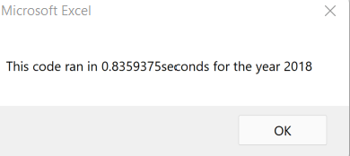
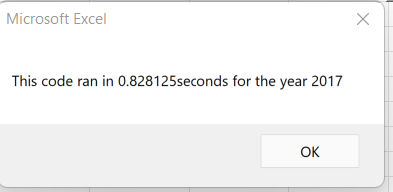
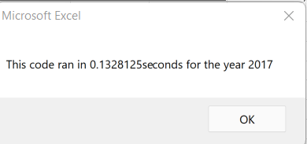
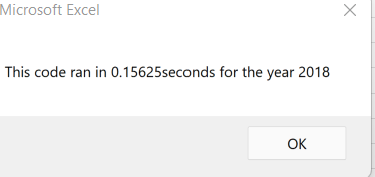

# VBA_Chalange2
analysis 0f 12 Green stocks of interest using VBA and excel
Exploring Green Energy Stock Performance by analyzing Financial Data using VBA
## Overview of Project
We helped steve analyze a handful of green energy stocks in addition to DAQO stocks where his parents were planning to invest their money. Steve loved the workbook we prepared for him. At the click of a button, he can analyze an entire dataset.

He wants to expand the dataset to include the entire stock market over the last few years. Although our code works well for a dozen stocks, it might not work as well for thousands of stocks. And if it does, it may take a long time to execute.

In this project, we will edit, or refactor, the Module 2 solution code to loop through all the data one time to collect the same information that we did in this module. Then, we will determine whether refactoring code successfully made the VBA script run faster.

Elapsed Time for 2017 and 2018 - Module 2

Refactor VBA code and measure performance using our knowledge of VBA and the starter code provided for the Challenge to refactor the Module 2 script we looped through the data and collected all information. Our refactored code below now runs faster than it did in this module.

Elapsed Time for 2017 and 2018 - Module 2 Refactored

### Purpose
To see if we cou;d get the code to run faster with refactoring it.
## Analysis and Challenges
WE only have the 12 stocks data to get the results from, and they want it to run for all stocks### Analysis of Outcomes Based on Launch Date
## Challenges and Difficulties Encountered
​What are the advantages or disadvantages of refactoring code?
### Some advantages:
	Can make the code more efficient—by taking fewer steps
	Can use less memory
	Can improve the logic of the code to make it easier for future users to read

### Some disadvantages:

	Can be risky when the application is big by introducing bugs
	Can be risky when existing code doesn't have proper test cases to find introduced bugs
	Can be risky when developers do not understand the original code
	Can takes extra time and budget that might not be available

## Summary Results
### Advantages
With these Macros created we can clearly see the table with analysis for each year. Steve can read the table lot easier due to conditional formatting. Updated Macro's can be used to run the analysis for any year.

We refactored the codes to run faster in VBA so that if Steve has a larger dataset he can analyze it quickly.
Advanatages of Refactoring codes.

Refactoring is a key part of the coding process. It just makes the code more efficient with fewer steps.
Refactoring codes help reduce the run time of the Macros.
It looks much cleaner and helps the future user to understand and read it better.

### Disadvanatages of Refactoring codes.
Refactoring codes can be time-consuming.
It might be difficult for larger and more complicated codes to refactor.
It may sometimes alter the outcomes

## What we did:
We successfully refactored the code to make it flexible and applicable to any new sheet Steve will be creating.

We generated a test sheet called "2009" to test our code and passed the test

We provided a .vbs file withe code laid out with comments so Steve can easily copy paste in Excel.

We made sure the buttons on Steve's spreadsheet worked.